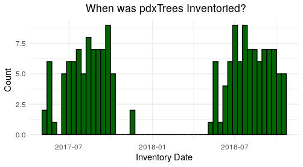

# pdxTrees

A Data Package composed of information for all the inventoried trees for public parks in Portland, Or. There are two datasets in the package, `pdxTrees`, which contains data on 15856 trees and `ohsuTrees`, which contains data on 875 trees in the parks surrounding the Oregon Health and Science University. 

These data were collected by the Portland Parks and Recreation's Urban Forestry Tree Inventory Project.   The Tree Inventory Project is completed in Portland every year, with select parks being inventoried each year. The data in `pdxTrees` was inventoried from July of 2017 to July of 2018. 
  More information on the data can be found [here](https://www.portlandoregon.gov/parks/article/501565).





`pdxTrees` is used in multiple Reed College statistics courses as a tool to help students learn and become more comfortable with the functionalities of RStudio. In Intro to Probablity and Statistics, `pdxTrees` is used to learn the components of graphics, wrangle data with `dplyr`, and create graphs with `ggplot2`. In the Data Science course, the package is used to learn the best practices of function writting, construct interactive maps with `leaflet`, and showcase the usefulness of `lubridate` along with many other R packages. 


# Install the package

```{r}
# Do the following once
# install.packages("devtools")

# Then install the package
devtools::install_github("mcconvil/pdxTrees")
```
