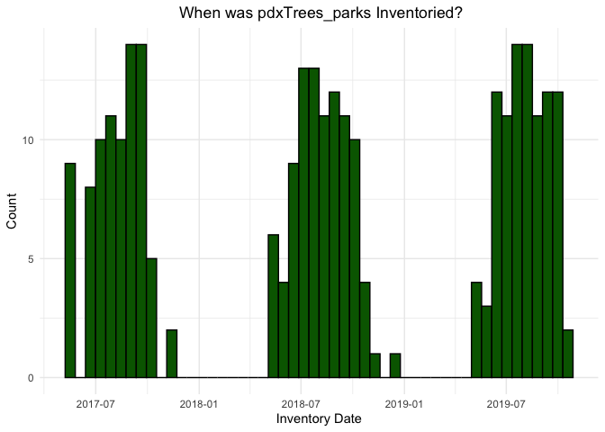

# pdxTrees

A Data Package composed of information for all the inventoried trees in
Portland, OR. There are three datasets in the package, `pdxTrees_parks`,
which contains data on 25534 trees,`ohsuTrees_parks`, which contains
data on 875 trees in the parks surrounding the Oregon Health and Science
University, and `pdxTrees_streets`, which contains data on 218,602 trees
located on Portland’s streets. A street tree is loosely defined as a
tree generally in the public right-of-way, usually between the sidewalk
and the street. Street trees are categorized by one of the 96 Portland
neighborhoods and the park trees are categorized by the public parks in
which they grow.

These data were collected by the Portland Parks and Recreation’s Urban
Forestry Tree Inventory Project. The Tree Inventory Project has gathered
data on Portland trees since 2010, collecting this data in the summer
months with a team of over 1,300 volunteers and Forestry employees. The
streets trees were inventoried from 2010 to 2016, and the park trees
that currently make up `pdxTrees_parks` and `ohsuTrees_parks`, were
inventoried from 2017 to 2019. More information on the data can be found
[here](https://www.portlandoregon.gov/parks/article/501565).

<!-- -->

`pdxTrees` is used in multiple Reed College statistics courses as a tool
to help students learn and become more comfortable with the
functionality of RStudio. In Intro to Probability and Statistics,
`pdxTrees` is used to learn the components of graphics, wrangle data
with `dplyr`, and create graphs with `ggplot2`. In the Data Science
course, the package is used to teach the best practices of function
writing, construct interactive maps with `leaflet`, and showcase the
usefulness of `lubridate` along with many other R packages.

# Install the package

``` r
# Do the following once
# install.packages("devtools")

# Then install the package
devtools::install_github("mcconvil/pdxTrees")
```

## Update

`pdxTrees` was update on June 25th to contain three data sets
`pdxTrees_parks`, `pdxTrees_streets`, and `ohsuTrees_parks`. New park
data from 2019 was added in addition to all of the street tree data.
Enjoy\!
